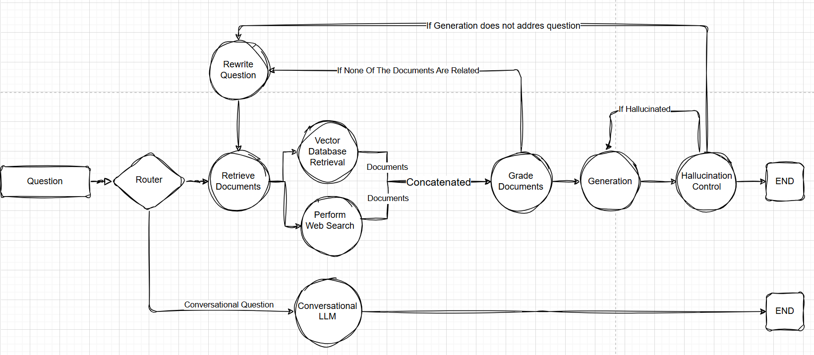
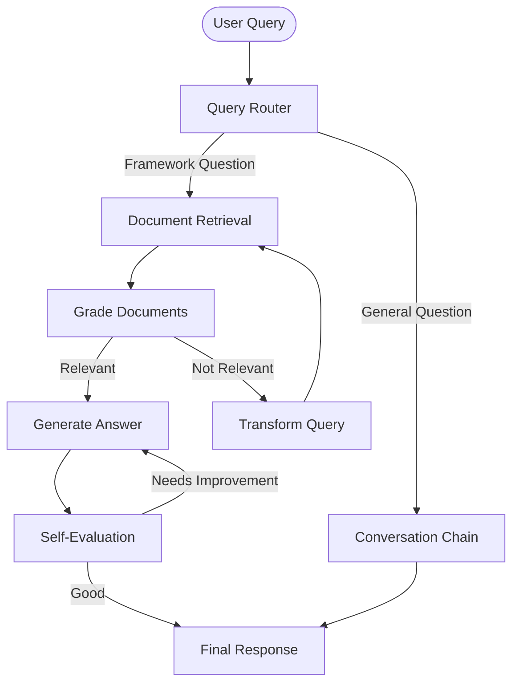

This project is a **Self-Reflective Framework Assistant** that uses Retrieval-Augmented Generation (RAG) with self-evaluation capabilities to provide accurate responses about technical frameworks and documentation [1](#0-0) .

# Self-Reflective Framework Assistant RAG

An adaptive framework support system that leverages Self-RAG (Self-Reflective Retrieval-Augmented Generation) to provide accurate, contextual responses for technical documentation and APIs through intelligent routing, document retrieval, and self-evaluation mechanisms.

## 🚀 Features

- **Intelligent Query Routing**: Automatically routes queries between retrieval-based processing (for framework-specific questions) and conversational processing (for general questions) [2](#0-1) 
- **Self-Reflective Evaluation**: Built-in quality assessment that checks for hallucinations and answer relevance [3](#0-2) 
- **Advanced Document Processing**: LLM-based summarization approach that processes entire documents instead of arbitrary chunking [4](#0-3) 
- **Multi-Source Retrieval**: Combines vector database search with web search for comprehensive information gathering
- **Adaptive Query Refinement**: Automatically rewrites queries when initial retrieval doesn't yield relevant results [5](#0-4) 

## 🏗️ Architecture

The system uses a **LangGraph-based workflow** with state management to orchestrate the self-reflective RAG process:

### Core Components

- **Routing Mechanism**: Determines optimal processing path based on query type [6](#0-5) 
- **Document Grading**: Evaluates relevance of retrieved documents [7](#0-6) 
- **Hallucination Detection**: Ensures generated responses are grounded in retrieved facts [8](#0-7) 
- **Answer Quality Assessment**: Verifies that responses address the original question [9](#0-8) 

### Running the Notebook

The project includes a comprehensive Jupyter notebook (`nb.py`) that demonstrates the full system capabilities including performance evaluation [10](#0-9) .

## 🧠 How It Works

### 1. Chunking Solution

Instead of traditional document chunking, the system uses **LLM-based summarization** [11](#0-10) :

- Processes entire documents as complete units
- Generates concise summaries (5-7 sentences)
- Creates potential user query examples
- Stores enhanced documents in vector database [12](#0-11) 

### 2. Self-Reflective Process

The system implements multiple self-evaluation loops:

- **Document Relevance Check**: Filters retrieved documents for relevance
- **Hallucination Detection**: Ensures answers are grounded in facts
- **Answer Quality Assessment**: Verifies responses address the question
- **Query Refinement**: Rewrites queries when needed for better results

### 3. State Management

Uses a `GraphState` model to track processing state throughout the workflow [5](#0-4) :

- `question`: Current user query (original or rewritten)
- `generation`: LLM-generated answer
- `documents`: Retrieved documents from vector DB and web search
- `query_rewritten_num`: Counter for query rewrites (prevents infinite loops)

## 📊 Performance Evaluation

The system includes built-in performance evaluation comparing three approaches [13](#0-12) :

- **Standard LLM**: Basic language model responses
- **Normal RAG**: Traditional retrieval-augmented generation
- **Self-RAG**: This system with self-reflection capabilities

Evaluation metrics include:
- Response relevance (0-5 scale)
- Latency measurements
- Factual grounding assessment

## 📄 License

This project is licensed under the MIT License - see the LICENSE file for details.

## Notes

Latest running version is nb.py.

The README is based on the existing project structure and capabilities as evidenced in the codebase. The system demonstrates a sophisticated approach to RAG with self-reflection capabilities, intelligent routing, and comprehensive evaluation mechanisms. The LLM-based chunking solution and multi-stage evaluation process are key differentiators from traditional RAG systems. 

## Pages you might want to explore

- [Routing Mechanism (erentorlak/Self-Reflective_Framework_Assistant_RAG)](https://deepwiki.com/erentorlak/Self-Reflective_Framework_Assistant_RAG/1.2-routing-mechanism)
- [Chunking Solution (erentorlak/Self-Reflective_Framework_Assistant_RAG)](https://deepwiki.com/erentorlak/Self-Reflective_Framework_Assistant_RAG/1.3-chunking-solution)
- [State Management (erentorlak/Self-Reflective_Framework_Assistant_RAG)](https://deepwiki.com/erentorlak/Self-Reflective_Framework_Assistant_RAG/3.1-state-management)
